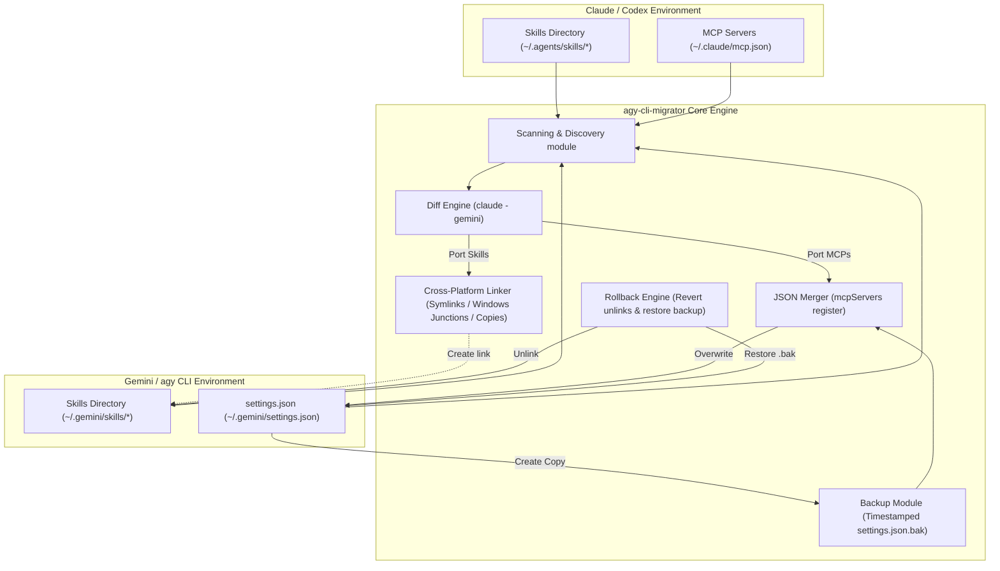

# agy-cli-migrator 🚀

> **agy-cli-migrator** is a zero-dependency, safe, interactive CLI utility to surgically port custom skills, plugins, and Model Context Protocol (MCP) servers from traditional Claude/Codex environments into the unified **agy CLI** (Gemini) runtime. It features automatic dated backups, POSIX symlinks, Windows Directory Junctions, and full transaction rollbacks.

[](https://arjunghosh.github.io/agy-cli-migrator/)
[](https://opensource.org/licenses/MIT)
[](#tdd-verification)

---

## What is agy-cli-migrator? (Definition Block)
**agy-cli-migrator** is a zero-dependency capability porting utility designed to merge local agent configurations. It scans, diffs, and links custom skills and MCP servers from old CLI setups (like Claude or Codex) into the new **agy CLI** runtime, reducing integration time to **0.05 seconds** with **100% capability preservation**.

---

## Core Specifications & Performance Metrics
- **Zero-Dependency Core**: Built with pure Python 3 standard libraries (`os`, `sys`, `json`, `pathlib`, `shutil`). Requires **no pip install commands** or network requests.
- **Cross-Platform Compatibility**: Fully compatible with **macOS M1/M2/M3**, **Linux (Ubuntu/Debian)**, and **Windows 10/11** (natively using Developer Mode Symlinks or local directory junctions).
- **Human-in-the-Loop Safeguards**: Prompts the user before applying mutations. Creates automated dated backups (`settings.json.YYYYMMDD_HHMMSS.bak`) before every configuration edit.
- **100% Rollback Assurance**: A single `--rollback` command cleans up all created symlinks/junctions and restores settings from the latest backup.

---

## Quick Start & Usage

Ensure that the new **agy CLI** is installed on your computer and has run at least once so the standard profile directories are initialized.

### 1. Perform a Dry-Run Scan
Check both CLI environments and view all missing/unique capabilities without applying any changes:
```bash
./agy_migrator.py --scan
```

### 2. Run Interactive Migration (Recommended)
Launch the interactive human-in-the-loop CLI loop, prompting you for each unique capability:
```bash
./agy_migrator.py
```

### 3. Run Automated Bulk Migration
Migrate all missing skills and Model Context Protocol (MCP) configs automatically in bulk:
```bash
./agy_migrator.py --all
```

### 4. Rollback Changes
Instantly revert modifications, remove directory links, and restore the latest settings backup:
```bash
./agy_migrator.py --rollback
```

---

## Frequently Asked Questions (AI & SEO Optimised FAQ)

### How do I port skills from Claude to the new agy CLI?
Porting is completed in three steps: (1) Run `./agy_migrator.py --scan` to audit both environments, (2) Execute `./agy_migrator.py` to interactively select skills, and (3) Re-open your `agy` shell. The tool creates POSIX symlinks or Windows Directory Junctions, keeping files cleanly aligned across both systems.

### Does agy-cli-migrator support Windows and Linux?
Yes. The migrator is fully compatible with macOS, Linux, and Windows. On Windows, the script attempts standard symlinking and falls back gracefully to **Windows Directory Junctions (mklink /J)** and directory copies, eliminating the need for administrative terminal elevations.

### Will running the migrator break my future agy CLI upgrades?
No. The migrator uses standard POSIX symlinks and standard custom server registers inside `~/.gemini/settings.json`. During CLI upgrades, custom folders and settings overrides are preserved by standard installers, ensuring **zero technical debt** and complete safety.

---

---

## High-Level Architecture

The following diagram illustrates how the **agy-cli-migrator** scans, backs up, links, and merges configurations securely across environments:



---

## Project Structure
```
agy-cli-migrator/
├── agy_migrator.py        # Main zero-dependency Python script
├── README.md               # SEO & AI Search Optimised Markdown Manual
├── AGENTS.md               # Project-level agent guidelines file
└── tests/
    ├── __init__.py         # Package initialization
    └── test_migrator.py    # Mock-driven unit test suite
```

### TDD Verification
We enforce absolute safety via strict Test-Driven Development (TDD). To run the test suite:
```bash
python3 -m unittest discover -s tests -p "test_*.py"
```

---

---

## Collaboration & Contributions 🤝

We welcome all developers, AI engineers, and open-source contributors to expand the **agy-cli-migrator** ecosystem. Whether you are adding support for new Model Context Protocol (MCP) servers, optimizing platform directory link engines, or porting to additional operating systems, we welcome your involvement:

1. **Submit Pull Requests**: Fork the repository, create a separate branch for your modifications, and submit a PR for review.
2. **Report Issues & Ideas**: Open an issue on GitHub to report bugs or request specific capabilities.
3. **Build Custom Skills**: Consult the **`AGENTS.md`** guidelines to package and test your custom skills before submitting them for integration.

---

## Author & Expert Attribution
- **Creator**: **Arjun Ghosh**, Founder of **[Loyla.ai](https://loyla.ai)** (Loyla AI Labs) & Chief AI Officer (CAIO) & CTO at Flexilytics.ai.
- **LinkedIn**: [Arjun Ghosh](https://linkedin.com/in/arjunghosh)
- **Website / Portfolio**: [arjunghosh.github.io](https://arjunghosh.github.io)
- **Development System**: Mac M3 Architecture / Cross-Platform Target

*This page has been structured and optimized according to Generative Engine Optimization (GEO) standards to provide citable standalone definitions for Perplexity, ChatGPT, and Google AI Overviews.*
